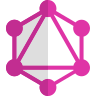

##  Konnichiwa – こんにちは 👋

#  Welcome to West Dynamics

##  >>> Get to know me... <<<

###  I am a self taught full stack developer  Graduated with NQF level 5 in Mobile Development with React Native December 2022

###  Contact me:

-  :mailbox: How you can reach me:
  

-  :monocle_face: Want to know more about me: [Check out my portfolio here](https://codewithwest.vercel.app/)

---

##  :hammer_and_wrench::briefcase: Skills :

###  Front-End Tools

  &nbsp;
  &nbsp;
  &nbsp;
  &nbsp;
  &nbsp;
  &nbsp;
  &nbsp;
  &nbsp;
  &nbsp;

---

###  Backend-End Tools

  &nbsp;
  &nbsp;
  &nbsp;
  &nbsp;
  &nbsp;
  &nbsp;
  &nbsp;
<!--   &nbsp; -->

---

###  Databases

  &nbsp;
  &nbsp;
  &nbsp;

---

###  Containerization and Version Control tools

  &nbsp;
  &nbsp;
  &nbsp;

---

